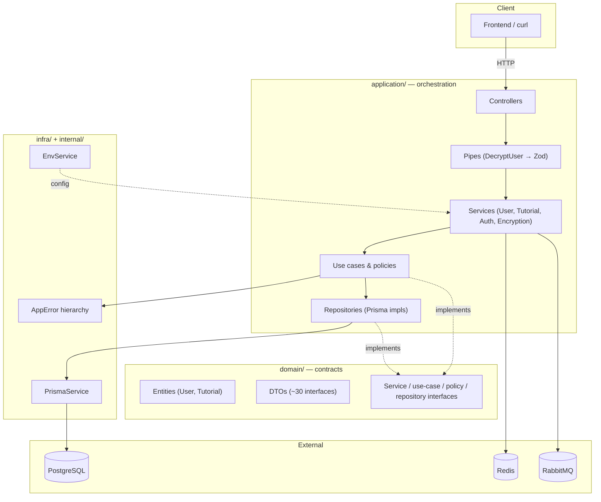
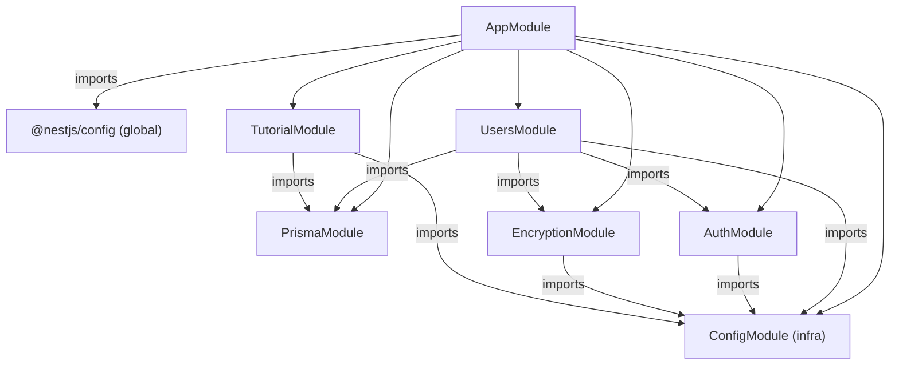
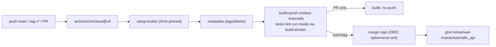

# Tutorialls API 🚀

> A full-stack tutorial platform API — register, authenticate, and manage tutorials with search filters, Redis caching, RabbitMQ eventing, and containerized delivery.


**Architecture type:** Clean/Hexagonal-inspired layered architecture with a domain-driven Contract layer (`domain/`), application orchestration (`application/`), and infrastructure engines (`infra/`) — wired through a centralized DI token registry.

🔭 **Live:** [tutorialls-api-sha256.onrender.com](https://tutorialls-api-sha256.onrender.com/) · 📑 **Swagger:** [/api/docs](https://tutorialls-api-sha256.onrender.com/api/docs)

---

## Table of contents

- [Overview](#overview)
- [Features](#features)
- [Architecture](#architecture)
  - [Layers](#layers)
  - [Module graph](#module-graph)
  - [The DI registry pattern](#the-di-registry-pattern)
- [Quick start](#quick-start)
- [API reference](#api-reference)
- [Domain rules](#domain-rules)
- [Testing](#testing)
- [CI/CD & Docker](#cicd--docker)
- [Repository structure](#repository-structure)
- [Quality gates & known issues](#quality-gates--known-issues)
- [Roadmap](#roadmap)
- [Commit conventions](#commit-conventions)
- [License & credits](#license--credits)
- [Deep-dive reports](#deep-dive-reports)

---

## Overview

Tutorialls API is a NestJS backend for a tutorial content platform. Users register and log in, then create, read, search, update, and delete tutorials. Reads are paginated and Redis-cached; every mutation emits an event to RabbitMQ; auth payloads may arrive encrypted and are validated with Zod.

The application was developed to explore production-grade backend practice: **Clean/Hexagonal architecture, JWT authentication, payload encryption, Redis caching, RabbitMQ eventing, and containerized deployment** — with the full stack running in Docker Compose and signed images published to GHCR.

**Stack:** NestJS 10 · TypeScript · Prisma 5 + PostgreSQL · Redis · RabbitMQ · JWT (Passport) · bcrypt · AES-256-CTR · Zod 3 · Jest · Docker · GitHub Actions + cosign

---

## Features

| Capability | Detail |
| --- | --- |
| 🔐 JWT authentication | Passport-jwt bearer tokens, `JwtAuthGuard` on 6/7 tutorial routes |
| 👥 User accounts | Signup with bcrypt hashing, duplicate detection, login with password validation |
| 📚 Tutorial CRUD | Create, list (public), filter by title/author/content, update, delete |
| 🧮 Pagination | `page`/`limit` query params → `{ items, total, limit, page }` |
| 🔒 Encrypted payloads | Optional AES-256-CTR ciphertext bodies on `/user/*` via `DecryptUserPipe` |
| ✅ Zod validation | `email` + `password ≥ 8` enforced on `/user/*` |
| ⚡ Redis caching | Cache-aside reads for list + filters (`tutorial:{op}:{limit}:{page}`) |
| 📨 RabbitMQ events | `ITutorialUpdatedEvent` emitted on every tutorial mutation |
| 📖 Swagger | Interactive docs at `/api/docs` |
| 🐳 Docker + CI | 5-service compose; GHCR publish with cosign signing |

Endpoint summary (full reference in [docs/api.md](docs/api.md)):

| Method | Path | Auth | Description |
| --- | --- | --- | --- |
| GET | `/` | — | App hello |
| POST | `/user/signup` | — | Register user → 201 |
| POST | `/user/login` | — | Authenticate → `{ token }` |
| POST | `/tutorial` | JWT | Create tutorial (emits event) |
| GET | `/tutorial` | public | List all, paginated |
| GET | `/tutorial/title` | JWT | Filter by title substring |
| GET | `/tutorial/author` | JWT | Filter by author substring |
| GET | `/tutorial/content` | JWT | Filter by keyword in content |
| PATCH | `/tutorial/:id` | JWT | Update tutorial (emits event) |
| DELETE | `/tutorial/:id` | JWT | Delete tutorial (emits event) |

---

## Architecture

### Layers



**The idea in one sentence:** business rules live behind pure TypeScript interfaces in `domain/`; `application/` orchestrates them; `infra/` provides the engines (Prisma, bcrypt, config). Controllers never touch `PrismaService` directly.

### Module graph



Seven modules, no circular imports — Auth and Encryption deliberately never import UsersModule. Deep dive: [docs/architecture.md](docs/architecture.md).

### The DI registry pattern

The project's signature wiring style: **providers are bound to string tokens** organized in `*.registry.ts` files and aggregated in `src/app.registry.ts`:

```ts
export const AUTH_REGISTRY = {
  SERVICE: { JWT: 'MODULE::AUTH::SERVICE::JWT' },
  USE_CASE: { TOKEN: { GENERATE: 'MODULE::AUTH::USE_CASE::TOKEN::GENERATE', /* … */ } },
};
```

Modules bind implementations to tokens; consumers inject against `domain/` interfaces:

```ts
// module
{ provide: MODULE.AUTH.SERVICE.JWT, useClass: JwtAuthService }

// consumer
constructor(@Inject(MODULE.AUTH.SERVICE.JWT) private readonly auth: IAuthService) {}
```

**Why:** contract-driven dependencies (dependency inversion), trivial `useValue` test doubles, and one source of truth for provider names. **Caveat:** tokens are strings — typos fail at bootstrap, not compile time, and several tokens in the tree have drifted (documented in [docs/architecture.md §5.3](docs/architecture.md#53-assessment)).

---

## Quick start

### Prerequisites

- [Docker](https://www.docker.com/) (Compose v2) — the recommended path
- **or** Node.js 20 + PostgreSQL 16 + Redis 7 + RabbitMQ 3 for a local run
- git

### 1. Clone

```bash
git clone git@github.com:Samuel-Ricardo/Tutorialls_API.git
cd Tutorialls_API/tutorialls        # the NestJS app lives in the nested folder
```

### 2. Environment

```bash
cp .env.example .env                # Windows: copy .env.example .env
# then edit the values
```

| Variable | Purpose | Variable | Purpose |
| --- | --- | --- | --- |
| `DATABASE_URL` | PostgreSQL connection string | `REDIS_HOST` / `REDIS_PORT` / `REDIS_TTL` | Redis cache |
| `JWT_SECRET` / `JWT_EXPIRES_IN` | HS256 signing key / token lifetime | `RABBITMQ_URL` / `RABBITMQ_QUEUE` | AMQP broker + queue |
| `ENCRYPT_KEY` / `ENCRYPT_ALGORITHM` / `ENCRYPT_BREAKPOINT` | Request-body cipher | `RABBITMQ_USER` / `RABBITMQ_PASS` | Broker credentials |
| `HASH_ROUNDS` | bcrypt cost factor | `RABBITMQ_HOST` / `RABBITMQ_PORT` | Broker networking |

> The example file ships **placeholder values** (e.g. `JWT_SECRET="secret"`, `HASH_ROUNDS=1`) — fine for local demo, replace with generated secrets for anything real (`openssl rand -base64 32`). Full reference with drift notes: [docs/devops.md §6](docs/devops.md#6-environment-variable-reference).

### 3. Run the stack

```bash
docker compose up --build           # first run; then `docker compose up`
```

| Service | URL | Notes |
| --- | --- | --- |
| API | <http://localhost:3000> | Swagger at `/api/docs` |
| PostgreSQL | localhost:5432 | dev credentials in `.env`/compose |
| Redis | localhost:6379 | — |
| RabbitMQ | <http://localhost:15672> | management UI |
| pgAdmin | <http://localhost:5050> | DB dashboard |

### 4. Apply migrations

Compose does **not** apply schema automatically — after the first `up`:

```bash
npx prisma migrate deploy           # applies the 7 versioned migrations
```

> Local (no Docker) variant: bring up `docker compose up -d postgres redis rabbitmq`, run `npx prisma migrate deploy`, then `npm run start:dev`.

### 5. Smoke test

```bash
curl http://localhost:3000/                 # "Hello World!"
curl -X POST http://localhost:3000/user/signup \
  -H "Content-Type: application/json" \
  -d '{"email":"sam@example.com","password":"s3cret-pass"}'
curl -X POST http://localhost:3000/user/login \
  -H "Content-Type: application/json" \
  -d '{"email":"sam@example.com","password":"s3cret-pass"}'
# → { "token": "eyJhbGciOi…" }
```

Prebuilt image (alternative to building):

```bash
docker pull ghcr.io/samuel-ricardo/tutorialls_api:main
```

---

## API reference

| Method | Path | Auth | Description |
| --- | --- | --- | --- |
| GET | `/` | — | App hello (health placeholder) |
| POST | `/user/signup` | — | Register user → `201` · `400` invalid · `409` duplicate |
| POST | `/user/login` | — | Log in → `{ token }` · `404` unknown user · `401` bad password |
| POST | `/tutorial` | JWT | Create → `201` tutorial DTO |
| GET | `/tutorial` | public | List all → paginated `{ items, total, limit, page }` |
| GET | `/tutorial/title` | JWT | Filter by title (insensitive substring) |
| GET | `/tutorial/author` | JWT | Filter by author |
| GET | `/tutorial/content` | JWT | Filter by content keyword |
| PATCH | `/tutorial/:id` | JWT | Update (all fields required) |
| DELETE | `/tutorial/:id` | JWT | Delete → `true` |

Full documentation — request/response examples, status codes, validation rules, and documented discrepancies between docs and code: **[docs/api.md](docs/api.md)** · Interactive: **Swagger `/api/docs`**.

---

## Domain rules

Business policies enforced in code ([docs/api.md §7](docs/api.md#7-validation-rules) for the validation contract):

| Rule | Enforcement | Failure |
| --- | --- | --- |
| Email must be unique | `UserShouldNotAlreadyExistsToSignupPolicy` → duplicate check | `409 UserAlredyExistsError` |
| User must exist to log in | `UserShouldExistsToAuthPolicy` → `findByEmail` | `404 UserNotFoundError` |
| Password must match | `BcryptPasswordShouldBeValidToLoginPolicy` → `bcrypt.compare` | `401 InvalidCredentials` |
| Email format + password ≥ 8 chars | Zod `SignupSchema` / `LoginSchema` | `400 InvalidDataError` |
| Passwords stored only as bcrypt hashes | `BcryptHashPasswordUseCase` (`HASH_ROUNDS`) | — |
| Tutorial reads are case-insensitive substring searches | Prisma `contains` + `mode: 'insensitive'` | — |
| Tutorial mutations emit events | `TutorialService.emit()` → `tutorials_queue` | — |

---

## Testing

Honest status: the suite exists (9 unit spec files, 36 tests + 3 e2e files, 7 tests) but **the local runner is currently broken** — the installed `node_modules` has a corrupted `jest-cli` (`Cannot find module '…jest-cli\build\index.js'`). Repair with `npm ci`, then:

```bash
# from tutorialls/
npm ci                 # repair the runner (required once)
npm test               # unit suite
npm run test:cov       # coverage report → tutorialls/coverage/
npm run test:e2e       # e2e — requires docker-compose infra (postgres, redis, rabbitmq)
```

**Key gaps, tracked honestly in [docs/testing.md](docs/testing.md):**

- Security-critical code (JWT strategy/guards, crypto use cases, repositories, exception filter) has **0% coverage** — and the JWT strategy is broken by inspection (claim mismatch).
- e2e expectations partially contradict the implementation (signup password length, login status codes).
- No coverage thresholds configured; `--passWithNoTests` can silently skip.
- QA verdict on the current state: **NOT READY — REJECT** (hardening path in [docs/testing.md §9](docs/testing.md#9-qa-roadmap)).

---

## CI/CD & Docker



- **Pipeline:** GitHub Actions builds, pushes, and **cosign-signs** the image to GHCR on `main`/tags; PRs get a build check without push.
- **Dockerfile:** multi-stage `node:20-slim`, non-root `USER node`, lockfile `npm ci`, layer caching.
- **Compose:** `app` + `postgres` + `redis` + `rabbitmq` + `pgadmin` — full local stack (diagram + walkthrough in [docs/devops.md](docs/devops.md)).
- **Known hardening needs:** no `.dockerignore` (patched by a `bcrypt` reinstall hack), migrations not auto-applied, husky hooks wired in the wrong location (inert), observability absent. **Deployment-readiness score: 3/10** — see [docs/devops.md §8](docs/devops.md#8-deployment-readiness-score).

---

## Repository structure

```text
Tutorialls_API/
├── .github/workflows/docker-publish.yml   # GHCR publish + cosign signing
├── .husky/                                # husky v9 scaffold (hooks currently inert)
├── LICENSE                                # MIT © 2024 Samuel_Ricardo
├── README.md                              # this file
├── docs/
│   ├── architecture.md                    # deep dive: layers, modules, registry, Prisma, lifecycle
│   ├── api.md                             # full API reference + discrepancies
│   ├── testing.md                         # test inventory, coverage gaps, QA roadmap
│   ├── devops.md                          # compose, Dockerfile, CI, env reference, readiness
│   ├── security.md                        # findings register + remediation roadmap
│   ├── development.md                     # setup, branching, commits, "add a use case" recipe
│   ├── adr/                               # architecture decision records
│   └── _drafts/                           # raw analysis reports (appendices)
└── tutorialls/                            # ★ the NestJS application (Docker context)
    ├── docker-compose.yaml                # app + postgres + redis + rabbitmq + pgadmin
    ├── Dockerfile                         # multi-stage node:20-slim
    ├── .env.example                       # tracked template (local .env is gitignored)
    ├── prisma/                            # schema.prisma + 7 migrations
    ├── src/
    │   ├── main.ts                        # bootstrap: CORS, filter, ValidationPipe, Swagger
    │   ├── app.module.ts                  # root module (7 modules imported)
    │   ├── app.registry.ts                # MODULE hub — aggregates feature registries
    │   ├── exception.filter.ts            # global error mapping
    │   ├── application/                   # auth · encryption · tutorial · users
    │   ├── domain/                        # entities, DTOs, contracts (pure TS)
    │   ├── infra/                         # prisma engine, bcrypt engine, env config
    │   └── internal/                      # AppError hierarchy
    └── test/                              # e2e specs (jest-e2e.json)
```

---

## Quality gates & known issues

The project is an excellent showcase of NestJS, clean-architecture intent, and CI/CD practice — **and** it ships with a set of findings that must be fixed before real-world production use. Everything is documented with evidence, no sugar-coating:

| # | Issue | Severity | Where |
| --- | --- | --- | --- |
| 1 | Plaintext password embedded in the JWT payload | Critical | [docs/security.md #S1](docs/security.md#s1) |
| 2 | Global exception filter double-writes responses and leaks raw errors | Critical | [docs/security.md #F1-F2](docs/security.md#f1) |
| 3 | Client crypto: reused IV, shared key, unauthenticated mode | Critical | [docs/security.md #E1-E3](docs/security.md#e1) |
| 4 | Hardcoded RabbitMQ credentials + duplicate client registration | Critical | [docs/security.md #I1](docs/security.md#i1) |
| 5 | Committed PostgreSQL data directory (~1,281 files) | High | [docs/devops.md §5](docs/devops.md#5-database-lifecycle) |
| 6 | No rate limiting, open CORS, no security headers | High | [docs/security.md #A2-A4](docs/security.md#a2) |
| 7 | Cache checked after DB read, never invalidated, shape drift on hit | High | [docs/security.md #A8](docs/security.md#a8) |
| 8 | Test suite blocked locally; security-critical code untested | High | [docs/testing.md §4-5](docs/testing.md#4-current-execution-status) |
| 9 | `/tutorial/*` endpoints unvalidated; pagination math breaks on bad input | High | [docs/api.md §7-8](docs/api.md#7-validation-rules) |
| 10 | Config drift (`CACHE_TTL` vs `REDIS_TTL`), missing env validation | Medium | [docs/devops.md §6](docs/devops.md#6-environment-variable-reference) |

> All findings trace back to evidence (file:line) in [docs/security.md](docs/security.md) and the raw analysis reports in [`docs/_drafts/`](#deep-dive-reports). Verified-clean areas (SQL-injection-free Prisma usage, `.env` never committed, SHA-pinned CI actions, non-root containers) are listed in [docs/security.md §1.7](docs/security.md#17-verified-clean-areas).

---

## Roadmap

**Security first** (see [docs/security.md §4](docs/security.md#4-remediation-roadmap)):

- [ ] Remove `password` from JWT; fix claim mismatch (`sub`); rotate signing secret
- [ ] Single-write exception filter with correlation ids; stop leaking raw errors
- [ ] Rework/remove client-side crypto: per-message IV, AEAD, or rely on TLS
- [ ] Untrack + ignore `.docker/data/db`; rotate exposed credentials
- [ ] Rate limiting (`@nestjs/throttler`), scoped CORS, `helmet`
- [ ] Prisma error mapping (`P2002` → 409, `P2025` → 404) + transactional signup

**Engineering quality:**

- [ ] Repair test runner (`npm ci`) → coverage thresholds ≥ 80% on `application/**` + `infra/**`
- [ ] Real validation for `/tutorial/*` + pagination caps + UUID `:id`
- [ ] Cache first or drop cache; invalidate on mutation; align TTL env names
- [ ] Dedicated CI test job (fast fail) + secret scan + `npm audit` + Trivy
- [ ] Wire husky hook at the repo root (it exists, misplaced)
- [ ] `.dockerignore`; remove the `bcrypt` reinstall hack; `prisma migrate deploy` in start sequence
- [ ] Registry token consistency pass + container-resolution spec

**Product direction** (hints from the codebase: no consumers yet, `startAllMicroservices()` registers nothing):

- [ ] First RabbitMQ consumer (audit log / search index) to close the event loop
- [ ] `/health` + `/metrics` + structured logging (terminus/prom-client/pino)
- [ ] Deploy job (Render/VPS) with documented rollback = previous image digest
- [ ] Refresh-token flow + `authToken` versioning for session revocation

---

## Commit conventions

Structured emoji format used throughout history (259 commits):

```text
[ <emoji> ] | <verb>: <subject> (<scope>)
```

```text
[ :sparkles: ] | implements: use-case - create > tutorial (module::domain)
[ :passport_control: ] | use: guard - jwt > tutorials (module::application)
[ :white_check_mark: ] | update: test - auth (app::test)
[ :syringe: ] | update: module - tutorials [rabbitmq] (module::application)
[ :card_file_box: ] | create: migration [create_tutorial_model] (app::database::prisma)
```

Emoji taxonomy: `:sparkles:` new code · `:label:` DTOs · `:card_file_box:` repos/migrations · `:passport_control:` auth · `:syringe:` DI · `:video_game:` controllers · `:white_check_mark:` tests · `:key:` env · `:construction_worker:` docker · `:heavy_plus_sign:` deps · `:bug:`/`:pencil2:` fixes · `:recycle:` renames · `:fire:` deletions · `:cloud:` RabbitMQ · `:memo:` docs. Full guide with branching flow: [docs/development.md §4](docs/development.md#4-commit-conventions).

---

## License & credits

MIT © 2024 [Samuel_Ricardo](https://github.com/Samuel-Ricardo) — see [LICENSE](LICENSE).

**Author — Samuel Ricardo**

- [GitHub](https://github.com/Samuel-Ricardo) · [LinkedIn](https://www.linkedin.com/in/samuel-ricardo/) · [Instagram](https://www.instagram.com/samuel_ricardo.ex/)

> Application developed for exploring dev skills — NestJS · Clean Architecture · Scalability

---

## Deep-dive reports

The raw analysis reports that informed this documentation remain in [`docs/_drafts/`](docs/_drafts/) as appendices:

| Report | Content |
| --- | --- |
| [`01-architecture-map.md`](docs/_drafts/01-architecture-map.md) | Full source tree, module tables, token inventory, request lifecycle, typo/dead-code inventory |
| [`02-code-analysis.md`](docs/_drafts/02-code-analysis.md) | Code quality, critical bugs, ranked top-10 fixes, security matrix |
| [`03-qa-analysis.md`](docs/_drafts/03-qa-analysis.md) | Test inventory, blocked-suite evidence, coverage gap map, DoD verdict |
| [`04-devops-analysis.md`](docs/_drafts/04-devops-analysis.md) | Compose/Dockerfile/CI/husky/secrets audit, readiness score |
| [`05-project-overview.md`](docs/_drafts/05-project-overview.md) | Product overview, endpoints, git history, docs gap analysis |

*Documentation compiled 2026-08-17 from evidence-verified source review.*
